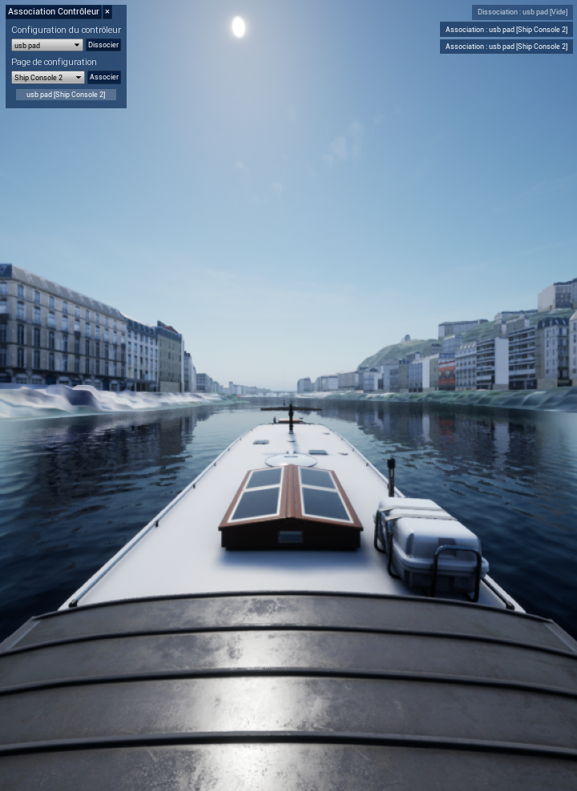
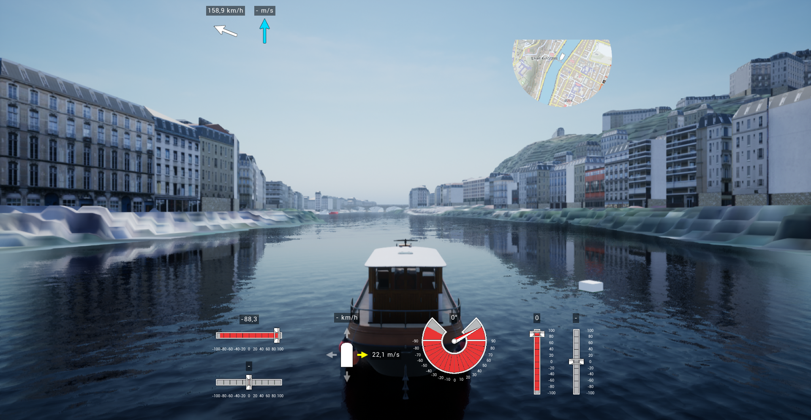
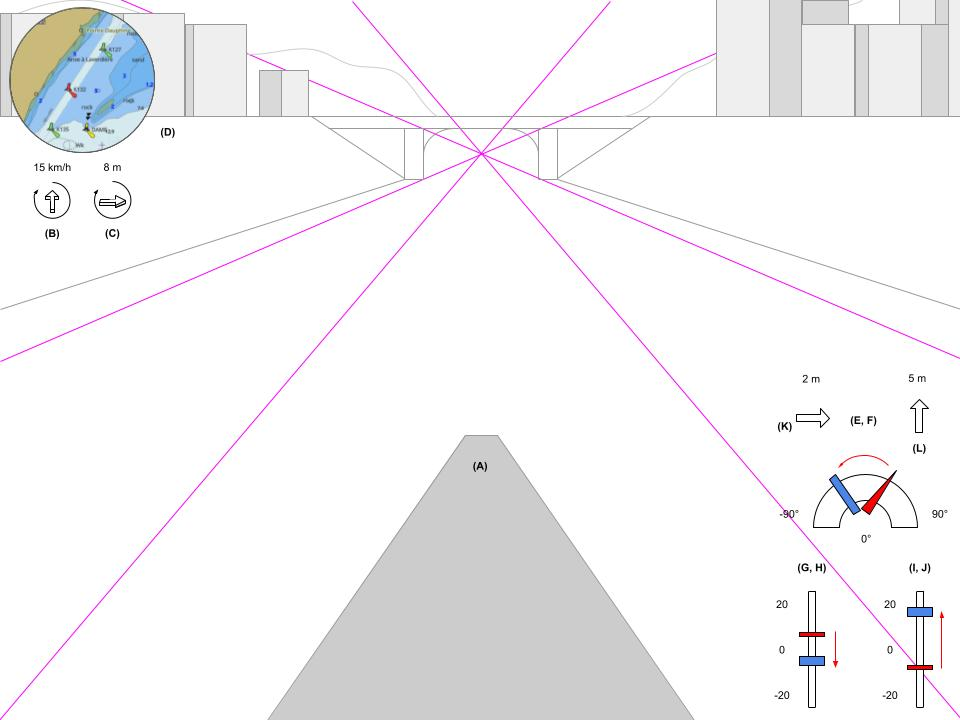

# Travail d'écriture de documentation

> L'idée derrière ce repo est de présenter un exemple d'écriture de documentation (consultable depuis le repo) que j'ai pu réaliser dernièrement.

## A. Présentation

Documentation du projet **Navmer3D**, rédigé à l'occasion du stage de **Développeur Logiciel C++ / Unreal Engine** au sein de la *Direction technique Risques, eau et mer* du *CEREMA*.

Le projet **Navmer3D** est documenté sur la base de plusieurs besoins :

* Transmission des connaissances acquises aux futurs développeurs, en visant la reproductibilité
* Détails de mise en place du système, détails du code (maintenance)
* Mode d'emploi des nouvelles fonctionnalités pour les utilisateurs (à l'exception de l'interface de navigation où les données sont connues)

La documentation complète est divisée en deux :

* `doc_navi.pdf` contient le mémoire sur le développement de l'interface de navigation.

* `doc_navmerinput.pdf` contient le mémoire sur le développement du plugin **NavmerInput**, qui intègre dans *Unreal Engine* les contrôleurs immersifs utilisés pour la navigation.

> ⚠️ Les documents PDF sont compressés. Pour consulter leur version non-compressée : Télécharger les fichiers `original_doc_navi.pdf` et `original_doc_navmerinput.pdf`.

> ⚠️ Certaines notions théoriques expliquées sont imprécises ou quelquefois fausses (notamment dans la partie sur l'interface de navigation), dû à certaines zones d'ombres dans mes connaissances au moment de l'écriture.

Les sections **C.** et **D.** proposent une introduction des missions, ainsi que quelques screenshots.

---

Documents rédigés avec *Pandoc* et *PlantUML*.

Lien vers le template *Latex* : https://github.com/Wandmalfarbe/pandoc-latex-template

## B. Navmer3D

Le projet **Navmer3D** est un projet de simulateur 3D de trajectographie de navires fluviaux.

L'objectif d'un tel projet est d'offrir la possibilité de réaliser une expertise fiable et robuste sur la faisabilité (entre autres) des traversées de navires en voies fluviales, tout en proposant une expérience immersive et plus proche du terrain pour les utilisateurs (qui sont des intervenants navigants).

Ce projet *Unreal Engine* à la particularité de proposer différentes scènes 3D modélisées automatiquement à partir de cartes locales de lieux géographiques, principalement de France.

## C. Plugin NavmerInput

**NavmerInput** est un plugin écrit en C++ en tant que plugin third-party pour le logiciel *Unreal Engine 4*.

L'objectif du développement d'un tel plugin était de répondre sous forme de solution logicielle à certains problèmes liés aux contrôleurs immersifs utilisés en interne.

Ces contrôleurs USB génériques de simulation de navigation présentaient, en plus de défaillances éléctroniques persistantes pour certains, des différences entre des appareils identiques (provoquées par l'acquisition d'un contrôleur et de son duplicata depuis différents vendeurs/fabriquants).

Ces différences sont caractérisées par :

1. Des différences de mapping sur les inputs discrets et analogiques
2. Des différences d'amplitudes (plages de valeurs) sur les commandes analogiques (p.ex. les manettes)

Lorsque le contrôleur et son duplicata sont connectés, le système perçoit deux mêmes appareils (`VendorID` et `ProductID` identiques) et leur attribue automatiquement un identifiant logiciel chacun.

Mais, il devient alors impossible d'avoir une configuration indépendante à chaque instance d'un même appareil : ce qui est nécessaire pour résoudre les problèmes générés par les points **1.** et **2.** (cf. deux paragraphes plus haut).

---

Le screenshot suivant (cf. **Figure a.**) présente l'utilisation en simulation du menu qui communique directement avec le plugin *NavmerInput* et qui permet de configurer (de manière minimaliste) les contrôleurs actifs.

À chaque changement (association et dissociation), des messages de feedback sont affichés à l'écran (dans le coin supérieur du viewport, à droite).

L'intéraction avec le menu se fait à la souris.
Le menu reste discret et peut être caché.

<figure align="center">
    
    <figcaption><strong>Figure a.</strong> Menu de configuration du plugin <em>NavmerInput</em> (dans le coin supérieur du viewport, à gauche)</figcaption>
</figure>

## D. Interface de navigation

L'interface graphique de navigation permet à l'utilisateur de visualiser en simulation un jeu de données temps-réel nécessaire à la navigation.

On retrouve parmi ces données :

* Des indicateurs de forces environnementales (vent, courant marin/fluvial)
* Les vitesses de déplacement axiale du navire (longitudinale et latérale)
* Réponses des commandes des contrôleurs de navigation (manettes de propulsion, et manette de gouvernail si le navire fonctionne avec un gouvernail)
* Une carte de navigation (une minimap avec un raster de carte *ENC* : https://en.wikipedia.org/wiki/Electronic_navigational_chart)

En pratique, ces données seules ne suffisent pas à l'expert navigant.
C'est cependant un jeu de données minimal suffisant pour simuler des scénarios de traversées.

L'affichage choisi est l'**affichage tête haute** ("ATH", ou "HUD" en anglais), utilisé en aviation et traditionnellement dans les jeux-vidéos.

Ce choix a été motivé par un besoin de configuration portable et mono-écran, mais aussi par soucis d'immersion.

D'autres besoins ont influencé le développement de l'interface, dont :

1. L'interface est intimement liée aux contrôles du navire
2. Une librairie de simulation physique des mouvements de navire doit être greffée à l'avenir au projet
3. Un manque de compétences graphiques au sein de l'entreprise

De ce fait, la construction de l'interface est divisée en deux parties : la logique métier (écrite en C++), et les **layouts**.

Ce procédé permettrait de séparer les métiers (programmation d'un côté, et design de l'autre), facilitant l'intervention externe d'un designer si besoin.

### Logique métier

---

Le système de l'interface fonctionne tel que l'on communique des objets (que j'ai appelés "états") au travers du flux de traitement de l'interface.

Un "état" transporte des informations de simulation (vent, courant, vitesse du navire...), ou de commandes (pour les intéractions contrôleurs).

Cette méthode est implémentée suivant un certain niveau d'abstraction, en prévision du point **2.** des besoins de l'interface (cf. 5 paragraphes plus haut).

Ces "états" sont ensuite transmis aux **layouts** pour l'affichage des données.

### Layouts

---

Les **layouts** (que j'ai appelés ainsi) forment différents affichages de l'interface, suivant le type de navire utilisé (p.ex. bâteau à gouvernail ou bâteau à pods azimutaux).

Un layout est dérivable et construisible simplement sous forme de widget (contenant d'autres widgets "atomiques"), et vient se "plugger" au coeur de l'interface.

De ce fait, il est tout à fait possible de changer dynamiquement de layout suivant le type de navire contrôlé.

Les widgets "atomiques" correspondent aux sliders de propulsion, gouvernail, minimap, et autres.

---

Le screenshot suivant (cf. **Figure b.**) présente le rendu final de l'interface en simulation.

<figure align="center">
    
    <figcaption><strong>Figure b.</strong> Interface graphique de navigation avec le layout pour bâteau à gouvernail</figcaption>
</figure>
 

L'image suivante (cf. **Figure c.**) présente un exemple de mockup réalisé (parmi plusieurs) en amont du développement de l'interface.

<figure align="center">
    
    <figcaption><strong>Figure c.</strong> Mockup du layout pour bâteau à gouvernail</figcaption>
</figure>